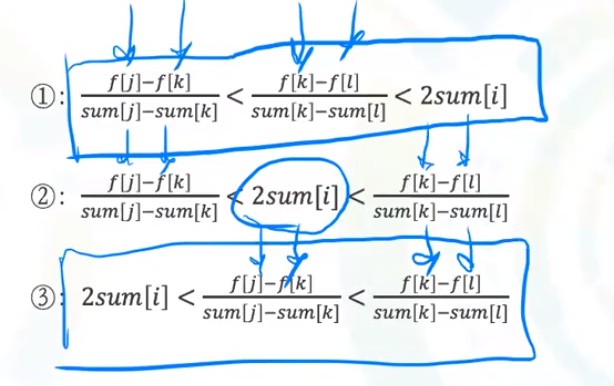

# HZOJ 52 古老的打字机 题解

## 题目描述

有一台古老的打字机和一篇待打印的文章，文章中有 n 个字符，每个字符会有一个消耗值 Ci, 打字机工作一次会打印若干连续的 k 个字符，同时打字机会有磨损，打字机的单次磨损计算公式为：

$(\sum_{i=begin}^{begin+k−1}Ci)^2+M$
其中 M 是打字机启动一次的固定磨损值，现在给你 n 个字符的消耗值，问你打字机顺序打印出这 n 个字符的最小磨损值为多少？


## 分析

显然这种问题会有很多重叠子问题，使用动态规划求解。

我一开始的做法：令状态$f(i)$表示打字机顺序打印前i个字符的最小磨损，那么很明显，状态转移方程为:
$$
f(i)=\min_{k=0}^{i - 1}(f(k)+(\sum_{j=k+1}^{i}C_i)^2+M)
$$

状态转移方程中有区间和，那么就构造前缀和数组，状态转移方程就变成了：
$$
f(i)=\min_{k=0}^{i-1}(f(k)+(S_i-S_{k-1})^2+M)
$$
继续拆分，获得状态转移方程：
$$
f(i)=\min_{k=0}^{i-1}(f(k)+S_{k-1}^2-2*Si*S_{k-1}+S_i^2+M)
$$
其中，我们称$f(k)+S_{k-1}^2$是查找值，$-2*S_i*S_{k-1}$是混合值，$S_i^2+M$是确定值。

这里有一类动态规划的优化技巧：

+ **如果状态转移方程仅由查找值与确定值组成，那么就可以维护一个最值、一个堆、单调队列、单调栈等可以加速查询操作的数据结构，此时多数为求出当前状态之后更新相关数据信息。**
+ 如果**状态转移方程中含有混合值，那么就使用斜率优化，斜率优化使用单调队列/单调栈的数据结构。**

我们假设$f(i)$通过$j,k$转移，那么$j$优于$k$的情况($k<j$)为：
$$
f(j)+S_{j-1}^2-2*S_i*S_{j-1}<f(k)+S_{k-1}^2-2*S_i*S_{k-1}
$$
 令$g(n)=f(n)+S_{n-1}^2$，则$g(j)-2*S_i*S_{j-1}<g(k)-2*S_i*S_{k-1}$，**分离查找值与确定值，**则，$\frac{g(j)-g(k)}{S_{j-1}-S_{k-1}}<2*S_i$。这个式子可以看作是斜率，而通过这个式子，我们可以知道，如果两个点$(S_{k-1},g(k)),(S_{j-1},g(j))$之间的斜率如果小于$2*S_i$那么就可以直接从j转移，而不用考虑k位置，反之亦然。

斜率优化的中：

+ **计算出的斜率就是用来判断从某个点转移是否会更优。**

  

+ **从上面的图中，我们可以绘制出斜率的图，可以发现，如果三个点的位置形成的斜率曲线是一个上突包/下突包，即前者大，后者小，根据题目的性质，我们可以不考虑中间的那个点。**
+ 如果两点之间斜率小于$2sum[i]$，那么后者更优，否则前者更优。


由此可以得到**斜率优化的大致过程：**

+ 新的点进入备选答案集合，判断新的点与前面一个点的斜率$k1$与前面一个点与再前面一个点的斜率$k2$的大小关系，如小于，则弹出前一个点。**==备选答案集合的斜率是单调递增的==**，**这个实际上维护的就是一个单调队列，==队首元素出队列，如果队首元素与下一个元素的斜率小于$2sum[i]$; 队尾元素进队列，去除那些违反了单调性的点==。**
+ 每次查询前都进行队首元素出队，这样第一个点就是最优点。


## 代码

### 一、斜率优化的代码

```c++
#include<iostream>
using namespace std;
#define MAX_N 1000000

#define SQ(a) ((a) * (a))

long n, m;
// f是查询值数组，q是单调队列
long c[MAX_N + 5], dp[MAX_N + 5], f[MAX_N + 5];
int q[MAX_N + 5], head, tail = 1;

// 将状态转移方程的过程抽象出来
void set(int i, int j) {
    dp[i] = dp[j] + SQ(c[i] - c[j]) + m;
    f[i] = dp[i] + SQ(c[i]);
}
// 计算斜率
double slope(int i, int j) {
    return 1.0 * (f[i] - f[j]) / (c[i] - c[j]);
}

int main() {
    cin >> n >> m;
    for (int i = 1; i <= n; i++) {
        cin >> c[i];
        c[i] += c[i - 1];
    }
    for (int i = 1; i <= n; i++) {
        // 如果队首元素与下一个元素的斜率小于2 * c[i]，队首元素出队列
        // 最终队首元素是最优的点
        while (tail - head >= 2 && slope(q[head], q[head + 1]) < 2 * c[i]) ++head;
        // 状态转移， 从队首元素所代表的最优点的位置转移到i
        set(i, q[head]);
        // 队尾元素进入队列之后维护队列的单调性
        while (tail - head >= 2 && slope(q[tail - 1], q[tail - 2]) > slope(q[tail - 1], i)) --tail;
        q[tail++] = i;
    }
    cout << dp[n] << endl;
    return 0;
}
```

