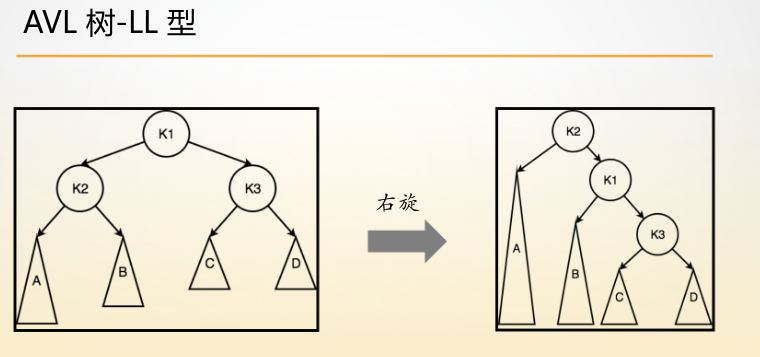
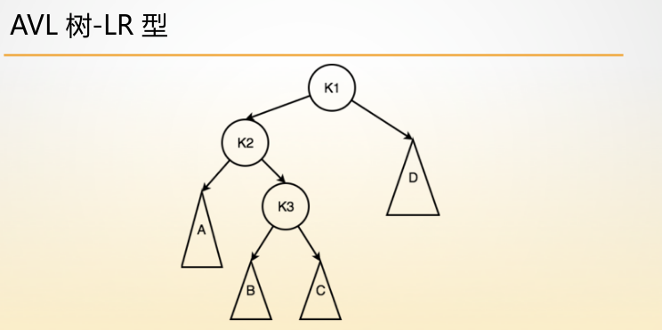
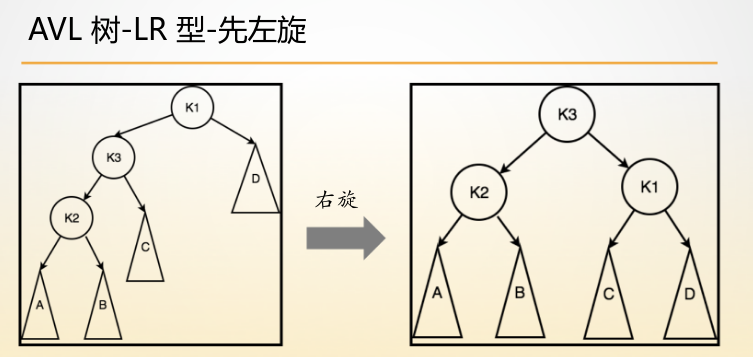

# AVL树

所有的**平衡二叉排序树的一个编码技巧，为了应对空地址的麻烦处理，我们使用$NIL$这个虚拟空节点来代替$NULL$。**

AVL树的插入与删除调整是同一套操作，其他的一些平衡二叉排序树的插入、删除的调整操作可能是两套操作。

## 一、AVL树基本原理

### 1.自平衡条件(==平衡二叉排序树维护的性质==)

**平衡因子(balance factor):**每个节点的平衡因子是指它左子树最大高度和右子树最大高度的差。

在AVL树中，平衡因子为-1,0,1的节点都被认为是平衡的，而平衡因子为-2、2等其他值的节点被认为是不平衡的，需要对这个节点所在的子树进行调整。

**自平衡条件就是平衡二叉排序树要维护的一个性质：**$|H(left)-H(right)| \le 1$


### 2.AVL树的节点个数范围

AVL树的节点个数上界就是$2^n-1$。

AVL树的节点个数下界的计算如下：

假设高度为h的AVL树的节点个数下界是$low(h)$ ，显然，其左右子树的最小节点个数可以是$low(h-1),low(h-2)$。

那么$low(h)=low(h-1) + low(h-2)+1$，这是一个类似于斐波那切数列的通项公式。可以计算出大致的下界就是$1.68^{n}$左右，**不同的平衡二叉树很多时候就是节点下界的个数的不同。**


### 3.旋转操作

#### (一)单旋(基础操作)

**在AVL树中，一共有两种单旋操作：左旋和右旋。**AVL树通过一系列左旋和右旋操作，将不平衡的树调整为平衡二叉查找树。

**对一个节点进行左旋，右旋就是将这个节点转到其原来的左孩子、右孩子所在的位置上，其原来位置被右孩子、左孩子代替。**


#### (二)多旋

**AVL树中还有两种复合旋转操作(即“多旋”)，由两次单旋操作组合而成：**

(1)左旋加右旋

(2)右旋加左旋


### 4.失衡情况 (LL,LR,RR,RL类型)

AVL树如果失衡，那么一定是**==一个节点的左子树与右子树的高度之差为2==。**

#### (1)左子树比右子树的高度大2

+ 如果**左子树中是左子树高**，那么就是**LL型，进行大右旋操作**

  + 

    可以看出来$h(a)=h(b)+1=max(h(c),h(d))+1$，另外，$h(a),h(b)$是绝对不可能高度相同的，否则在这之前就是b更高，早就该调整了。

    

+ 如果**左子树中是右子树高**，那么就是**LR型，先进行小左旋，后进行大右旋**

  + 

  + 

    如果是LR类型的失衡，那么可以很明显看出$h(a)=h(b)=h(c)=h(d)$。

    

#### (2) 右子树比左子树高度大2

+ 如果**右子树的右子树高**，那么就是**RR型，进行大左旋操作**
+ 如果**右子树的左子树高**，那么就是**RL型，先进行小右旋，后进行大左旋**


平衡二叉树失衡的类型以及模型如图所示：


**这是AVL树失衡时的粗略的图，K1是失衡点(但是K1的左右子树不失衡)。AVL树的普遍失衡模型由以下三部分组成：（1）失衡点（2）失衡点左右孩子（3）失衡点左右孩子的左右子树。当然LL型和RR型有线性的特殊情况。**(==另一种理解方式就是LL，LR，RR，RL型的失衡是失衡点相应的孩子的哪棵子树大、深。==)

但是在实际进行调整的时候，我们需要对相应的子树再进行细化，比如**LL型进行右旋，就细化失衡点的左孩子的左子树，RR型进行左旋，就细化失衡点的右孩子的右子树。**其他的也是一样的。要**完成LR型和RL型的，需要更加详细一点，需要对下层的相应子树再划分为根节点和左右子树**，如下图所示：


> ==在所有调整失衡的操作中，最终失衡点都会被替代==


### 5.失衡调整的本质操作的思考

从上面可以看出**失衡调整的基础操作是左旋和右旋操作。** 

==**右旋操作的结构参照LL型，左旋操作的结构参照RR型。**==

而复合的LR型和RL型实际上就是左旋和右旋操作的组合。

对于**LR型**，是**先进行小左旋，即将失衡点左孩子也展开为三层结构**，**进行小左旋后，相当于转化为了LL型，此时进行大右旋。**

==在LL型和LR型的操作中，最后都是进行大右旋，所以可以统一操作。**先判断是否是LR型，是则进行小左旋，之后统一进行大右旋**。==

对于**RL型**，是**先进行小右旋，即将失衡点右孩子也展开为三层结构**，**进行小右旋之后，相当于转化为了RR型，再进行大左旋。**

==在RR型和RL型的操作中，最后都是进行大左旋，所以可以统一操作。**先判断是否是RL型，是则进行小右旋，之后统一进行大左旋**。==

左旋和右旋操作都会造成部分节点高度的改变，需要更新这些节点的高度。

==在进行左旋的时候，只有根节点及其右孩子的高度发生了变化; 在进行右旋的时候，只有根节点及其左孩子的高度发生了变化。==


### 6、会导致失衡的操作

####  (一)插入操作

在插入一个元素后不断回溯的过程中，如果因此导致节点不平衡，则根据**不平衡情况(一定是一边子树比另一边子树的高度大2)**进行对应的旋转。


#### (二)删除操作

在删除一个元素后不断回溯的过程中，如果因此导致节点不平衡，则和插入操作采用相同的调整操作，确保在删除以后整棵树依然是平衡的。


## 二、AVL树的结构定义

AVL树需要维护树的高度，所以结构定义中需要加上高度，其他和正常二叉树一样。

```c++
typedef struct Node {
    int key, h;
    struct Node *lchild, *rchild;
} Node;
// 节点高度的初始化一定是1,不能是0！！！因为一个节点的高度至少就是1.
```


## 三、AVL树的结构操作

### 1.插入节点

AVL树的插入节点操作基本上和普通二叉排序树的节点插入一样，只是加入了高度更新和失衡调整操作。**高度更新和失衡调整(维护)都是在节点已经插入完成之后进行的，并且都是在回溯阶段进行更新和调整的。**

```c++
// 获得根节点的高度，插入与删除，左旋、右旋，在调整之后都需要更新节点高度
void UpdateHeight(Node *root) {
    int h1 = root->lchild->h;
    int h2 = root->rchild->h;
    root->h = 1 + (h1 > h2 ? h1 : h2);
}

// 左旋操作，根据RR型想象操作过程，之后更新高度发生变化的节点的高度
Node *left_rotate(Node *root) {
    Node *temp = root->rchild;
    root->rchild = temp->lchild;
    temp->lchild = root;
    UpdateHeight(root);
    UpdateHeight(temp);
    return temp;
}
//右旋操作，根据LL型想象操作过程，之后更新高度发生变化的节点的高度
Node *right_rotate(Node *root) {
    Node *temp = root->lchild;
    root->lchild = temp->rchild;
    temp->rchild = root;
    UpdateHeight(root);
    UpdateHeight(temp);
    return temp;
}

// 维持平衡的操作
Node *maintain(Node *root) {
    // 左右子树高度差绝对值小于等于1，没有失衡
    if (abs(root->lchild->h - root->rchild->h) <= 1) return root;
    // 根据左右子树高度判断失衡大体类型
    // 左子树高，则为L型
    if (root->lchild->h > root->rchild->h) {
        // 继续判断详细类型，由于LL型和LR型最后都会进行大右旋操作，所以可以统一操作，这里只需要判断是否是LR型的，如果是的话，先进行小左旋
        if (root->lchild->rchild->h > root->lchild->lchild->h) {
            root->lchild = left_rotate(root->lchild);
        }
        // LL型和LR型统一的大右旋操作
        root = right_rotate(root);
    } else {
        // 右子树高，则为R型
        // 继续判断详细类型，由于RR和RL型最后都会进行大左旋操作，所以可以最后统一进行大左旋，这里只需要判断是否是RL型，若是，则先进行小右旋
        if (root->lchild->rchild->h < root->lchild->lchild->h) {
            root->rchild = right_rotate(root->rchild);
        }
        root = left_rotate(root);
    }
    return root;
}

// 插入操作基本和二叉查找树的插入操作相同，只是多了更新节点高度和维护平衡的操作
Node *insert(Node *root, int key) {
    if (root == NIL) return getNewNode(key);
    if (root->key == key) return root;
    if (root->key > key) root->lchild = insert(root->lchild, key);
    else root->rchild = insert(root->rchild, key);
    // 这里涉及到递归程序的递归向下阶段操作的区域和回溯操作的区域
    // 更新节点高度是在回溯阶段的操作，所以是在回溯阶段的区域中
    // 在编写递归程序的时候需要考虑清楚，哪些操作是在递归向下阶段的操作，哪些是在回溯阶段的操作，以此来决定操作的位置。
    UpdateHeight(root);
    return maintain(root);
} 
```


### 2.删除节点

AVL树的删除节点操作大体上是和二叉查找树一样，只是增加了高度更新和失衡调整(维护)。**高度更新和失衡调整(维护)都是在节点已经删除之后进行的，并且都是在回溯阶段进行更新和调整的。**

```c++
Node *predecessor(Node *root) {
    Node *temp = root->lchild;
    while (temp->rchild) temp = temp->rchild;
    return temp;
}

Node *erase(Node *root, int key) {
    if (root == NIL) return root;
    if (root->key > key) root->lchild = erase(root->lchild, key);
    else if (root->key < key) root->rchild = erase(root->rchild, key);
    else {
        if (root->lchild == NIL || root->rchild == NIL) {
            Node *temp = root->lchild != NIL ? root->lchild : root->rchild;
            free(root);
            return temp;
        } else {
            Node *temp = predecessor(root);
            root->key = temp->key;
            root->lchild = erase(root->lchild, key);
        }
    }
    // 节点删除完成后，在回溯阶段进行高度更新和失衡调整
    UpdateHeight(root);
    return maintain(root);
} 
```

