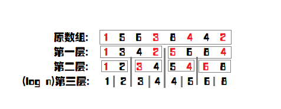

# 划分树

划分树是一种用来解决区间第K大的数据结构，实现比主席树容易。同时，划分树紧贴“第K大”，所以是一种基于排序的数据结构。

**划分树的思想爱那个实际上是将快排的步骤记录下来，然后根据快排过程中的信息求每一个区间的第K大数。**


## 一、原理

划分树的**思想与快速排序一致**。设原数组元素个数为n，那么划分树的层数为$\lceil \log n \rceil$。我们会对每层的相应部分**选出其中位数，将小于等于其中位数的移到左边，否则移到右边**。因为中位数可能有相同，而且与n的奇偶有一定关系。

划分树的结构如下图所示：



我们不可能每次对每一层进行排序，但是，**找中位数，一次排序就足够了。**排序结束后中位数两侧和划分树划分之后的两侧对应的内容是一样的，只是顺序不同罢了。


## 二、结构定义与结构操作

### 1.结构定义

```c++
#define MAX_N 100000
int tree[25][MAX_N + 10]; // 划分树结构，要存下所有的值，第一维代表当前树的层数，空间复杂度O(n log(n))
int toleft[25][MAX_N + 10]; // 第一维代表当前树的层数，第二维代表当前层划分区间[1, i]里进入左子树的数目，这实际上是前缀和数组，其差值才是进入左子树的节点数目
int sorted[MAX_N + 10]; // 将初始序列排好序的数据，用于确定中位数
```


### 2.建立划分树

建立划分树的过程中，需要记录下移到左子树的节点数目，**此时，可能会遇到存在多个中值的情况，而又要求左右区间的数量尽可能的均等。**为了解决多个中值的问题，可以**先假设中点左边的数据都小于中值**，即令$same=mid-left+1$，如果当前的数小于中值，就使same减一，**如果中点左侧的数据都小于中值，那么最后same应当为1，否则，就说明，中值的数量不唯一**。那么，在下面进行的时候，如果same > 1就先把中值放在左子树，直到same=0，如果还有中值，就把剩下的放入右子树，如此就可以均分左右子树。

```c++
void build_tree(int level, int left, int right) {
    if (left == right) return ;
    int mid = (left + right) >> 1;
    // same用于指示sorted[mid]的mid左侧会有多少相同的中值
    int same = mid - left + 1;
    for (int i = left; i <= right; i++) {
        if (tree[level][i] < sorted[mid]) same--;
    }
    // 因为当前区间不一定有序，为了正确填写下一层的数字，需要记录左右区间的起始位置
    int subLeft = left, subRight = mid + 1;
    for (int i = left; i <= right; i++) {
        // 维护前缀和数组to_left，表示[left,i]区间内左子树的节点个数
        to_left[level][i] = to_left[level][i - 1];
        // 如果有一个进入左子树的节点
        if (tree[level][i] < sorted[mid] || (tree[level][i] == sorted[mid] && same > 0)) {
            tree[level + 1][subLeft++] = tree[level][i];
            // [left,i]部分进入左子树的节点数量加一
            to_left[level][i]++;
            // 判断是否是中位数
            if (tree[level][i] == sorted[mid]) same--;
        } else tree[level + 1][subRight++] = tree[level][i];
    }
    // 根据第level层计算出level + 1层的内容，继续向下求解
    build_tree(level + 1, left, mid);
    build_tree(level + 1, mid + 1, right);
}
```


### 3.查询区间第K大值

划分树**查询区间第K大值，要查询的区间是$[qLeft, qRight]$，初始的大区间是$[left, right]$。**具体的执行流程就和普通的第n大数问题、SB Tree的查找过程类似。

+ 先判断$[qLeft, qRight]$在$[left, right]$的哪棵子树中，然后找出对应的小区间和K。

  之后递归查找，直到小区间$qLeft=qRight$时为止。

+ 这就用到了之前记录的to_left，即level层[left, i]的进入左子树的节点数量。

  因此，在区间$[left,qLeft-1]$中有$to\_left[level][qLeft-1]$个元素进入了左子树，记为$lef$，同理在区间$[left,qRight]$中有$to\_left[level][qRight]$个元素进入了左子树，记为$rig$，因此，在区间$[qLeft,qRight]$之间就有$rig-lef$个元素进入了左子树，记为$toLef$。

  如果$toLef\ge K$，说明第K大元素肯定进入了左子树，那么就进入左子树中找第K大的元素，否则，进入右子树查找。

+ 接下来解决确定小区见的问题：

  + 如果进入的是左子树，那么小区间就是
    $$
    [left+区间[left,qLeft-1]进入左子树的数目，\\left+区间[left,qRight]进入左子树的数目-1]
    $$
    即$[left+lef,left+lef+toLeft-1]$。此时K值不用变化。

  + 如果进入的是右子树，那么小区间就是
    $$
    [mid+区间[left,qLeft-1]进入右子树的数目+1,\\
    mid+区间[left,qRight]进入右子树的数目]
    $$
    即$[mid+qLeft-left-lef+1，mid+qRight-left-toLeft-lef+1]$，同时$K=K-toLef$。

> 之所以可以这么变化要查找的区间，是因为在排序好的数组里，第K个值就是在变化的区间内，并且，由于划分树两侧数据和排序数据仅仅是顺序不同，其余都相同。

```c++
int query(int level, int x, int y, int l, int r, int k) {
    if (x == y) return tree[level][x];
    // [x,y]区间中进入左子树的个数，这里需要判断x是否等于l，因为x == l的话，意味着这是当前子树对应前缀和的第一个，要特殊处理
    int cnt = to_left[level][y] - (x == l ? 0 : to_left[level][x - 1]);
    int mid = (l + r) >> 1;
    // 如果第K大数字在左子树
    if (cnt >= k) {
        // x == l ? 0 : to_left[level][x - 1] 返回值为[l,x-1]进入左子树的个数，在不减1的情况下，这就相当于是确定第x个数的下标
        int st = l + (x == l ? 0 : to_left[level][x - 1]);
        // [l,y]进入左子树的个数，要求的是下标，所以需要减1
        int ed = l + to_left[level][y] - 1;
        return query(level + 1, st, end, l, mid, k);
    } else {
        // x - l表示[l,x-1]的节点个数，减去进入左子树的个数就得到了进入右子树的个数，由此得到新的起始下标
        int st = mid + 1 + x - l - (x == l ? 0 : to_left[level][x - 1]);
        // y - l + 1 - to_left[level][y]获得的是[l,y]进入右子树的节点数量，之后减1得到下标
        int ed = mid + 1 + y - l - to_left[level][y];
        return query(level + 1, st, end, mid + 1, r, k - cnt);
    }
}
```

