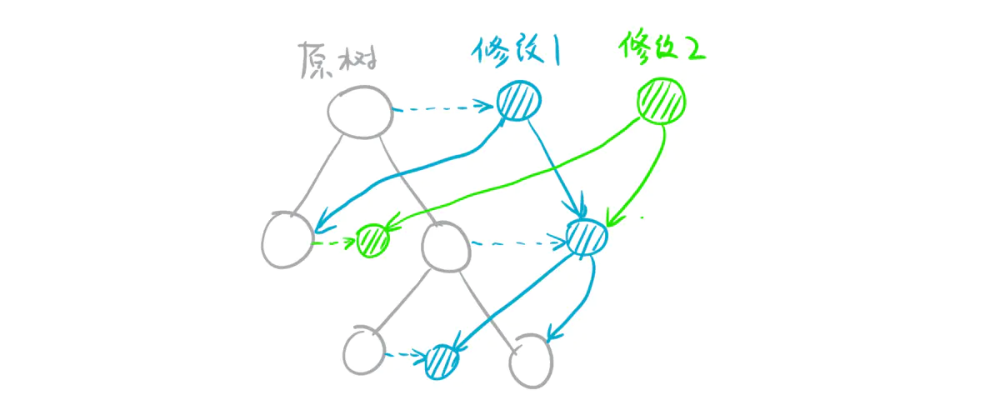

# 可持久化线段树

可持久化是指保存了数据修改的历史信息，对可持久化线段树进行修改操作，操作完成之后我们就可以在线段树原有的时间复杂度内查询到希望查询的版本信息。

通常遇到的**线段树都是构建后结构不变化的，所以在修改关键值时，只有节点内的值受到影响，而树本身的结构不发生变化**(比如左右子节点所表示的区间)。这为线段树进行可持久化提供了便利。我们**每次修改的时候不直接改动原来节点的值，而是创建一系列新的节点。**

在线段树的单次修改中，实际上收到影响的节点是有限的，原来的节点可以得到重复利用。


## 一、修改的过程

可持久化线段树**每次修改都会自上而下地新建一些节点**。**每次修改后的版本都有一个根节点与之对应**。

令T表示一个节点，其左儿子是$left(T)$，右儿子是$right(T)$。如果T的范围是$[L,R]$，那么$left(T)$的范围是$[l,mid]$，$right(T)$的范围是$[mid+1,R]$。

### 1.单点修改

经过分析可以发现，单点修改时，只会更改$O(\log n)$个节点，在结构上形成一条链。

因此，进行单点修改时，我们将递归过程中的所有节点创建一个“影子节点”，“影子节点”保存的是当前修改结束后的受到更改的值。



另一张图：


我们要修改一个叶子节点的值，并且不能影响旧版本的结构，在**从根节点递归向下寻找目标节点时，将路上经过的节点都复制一份**。

**找到目标节点后，新建一个叶子节点**，使其值为修改后的版本，并将其地址返回，对与一个非叶子节点，其最多只有一个子节点会被修改，那么只需要对被修改的字节点调用修改函数，那么就得到了其修改后的孩子。**每一步都向上返回当前节点的地址，使父节点可以收到修改后的子节点**。

由于每次要动态申请节点，所以可持久化线段树不可以使用堆式存储，而是动态开点，并保存每个节点的左右儿子编号(类似于链式前向星，SAM的构造方法)。


## 二、查询操作

可持久化线段树的查询操作与线段树的查询操作类似。从要查询的版本的根节点开始，类似普通线段树那样查询即可。


## 三、主席树的结构定义与结构操作

主席树是用来**解决区间第k小问题**的可持久化权值线段树。因为每次要查询区间$[l,r]$的区间k小值。

### 1.查询$[1,n]$中的第k小值

我们先**对数据进行离散化**，然后**按照值域建立线段树**，**线段树维护某个值域中的元素个数**。

在线段树的**每个节点上用cnt记录这一个值域中的元素个数**。

那么要寻找第k小值，从根节点开始处理，若左儿子中表示的元素个数大于等于K，那么我们递归处理左儿子，寻找左儿子中第k小的数;

若左儿子中的元素个数小于K，那么第K小的元素在右儿子中，我们需要右儿子中第$(k-左儿子中元素个数)$小的数。(**这中操作类似于size balanced tree和线性时间找第k小元素算法。**)


### 2.查询区间$[L,R]$中的第k小值

我们按照从1到n的顺序依次将数据插入可持久化线段树中，就会得到n+1个版本的线段树(包括初始化的版本)，将其编号为0到n。

可以发现所有版本的线段书都拥有相同的结构，它们同一个位置上节点的含义都相同。

考虑第i个版本的**可持久化线段树的根节点P，P中储存的值表示$[1,i]$这个区间中P节点值域所包含的元素个数。**

假设我们知道了$[1,R]$区间中P节点的值域中所包含的元素个数，也知道$[1,L-1]$中P节点的值域中所包含的元素个数，显然用第一个减去第二个数，就可以得到$[L,R]$区间中的元素个数。(这**类似于前缀和数组求区间和的操作**)

因此，我们对于一个查询$[L,R]$，同时考虑两个根$root[L-1]$与$root[R]$，用它们同一个位置的节点的差值就表示了区间$[L,R]$中的元素个数，利用这个性质，从两个根节点，向左右儿子中递归查找第k小数即可。


### 3.代码与解释

```c++
#define MAX_N 100000

struct Node {
    int cnt, left, right;
};

int n, m, total, len;
// nums是输入数字，ind是对应数字离散化后的下标，rt是每次增加一个数字后的每个线段树历史版本的根节点
int nums[MAX_N + 5], ind[MAX_N + 5], rt[MAX_N + 5];
Node node[MAX_N << 5 + 5];

// 获取数字的对应离散化下标
int getid(int &val) {
    return lower_bound(ind + 1, ind + len + 1, val) - ind; 
}

int build(int l, int r) {
    int root = ++total;
    if (l == r) return root;
    int mid = (l + r) >> 1;
    node[root].left = build(l, mid);
    node[root].right = build(mid + 1, r);
    return root;
}

int update(int k, int l, int r, int root) {
    int temp = ++total;
    // 拷贝一份
    node[temp].left = node[root].left, node[temp].right = node[root].right, node[temp].cnt = node[root].cnt + 1;
    if (l == r) return temp;
    int mid = (l + r) >> 1;
    if (k <= mid) node[temp].left = update(k, l, mid, node[root].left);
    else node[temp].right = update(k, mid + 1, r, node[root].right);
    return temp;
}

// u，v表示输入的数字的次序编号，l，r是节点对应的离散化后的区间，k表示要找第k小数字
int query(int u, int v, int l, int r, int k) {
    int mid = (l + r) >> 1;
    // 类似SB树，线性时间找第k小/大数字的算法
    int x = node[node[v].left].cnt - node[node[u].left].cnt;
    if (l == r) return l;
    if (k <= x) return query(node[u].left, node[v].left, l, mid, k);
    return query(node[u].right, node[v].right, mid + 1, r, k - x);
}

void init() {
    cin >> n >> m;
    for (int i = 1; i <= n; i++) cin >> nums[i];
    memcpy(ind, nums, sizeof(nums));
    sort(ind + 1, ind + n + 1);
    // 离散化
    len = unique(ind + 1, ind + n + 1) - ind - 1;
    rt[0] = build(1, len);
    // 这一步就是可持久化的操作，rt存储的就是线段树的历史版本
    for (int i = 1; i <= n; i++) rt[i] = update(getid(nums[i]), 1, len, rt[i - 1]);
}

int l, r, k;
void work() {
    while (m--) {
        cin >> l >> r >> k;
        cout << ind[query(rt[l - 1], rt[r], 1, len, k)] << endl;
    }
}
```


