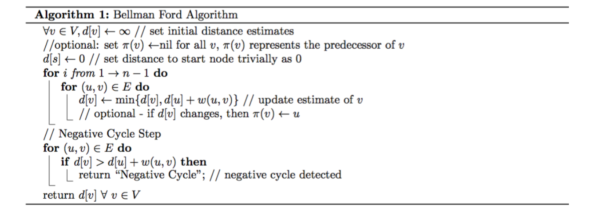
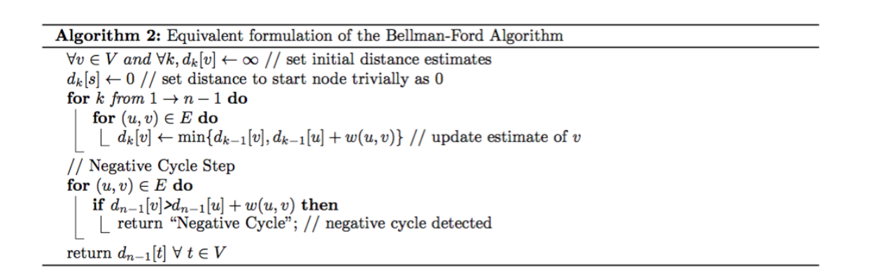

# Bellman-Ford单源最短路算法（允许负数边权）

Bellman-Ford是用于**检测存在负数边权的图中单源最短路径的算法，但是不能有负数环**。

**Bellman-Ford算法本质上是动态规划**。设图中有n个节点，m条边，那么**算法的时间复杂度为$O(nm)$**。

状态定义：设**$d_{k}(v)$为从$s$到$v$使用$\le k$​条边的最短路径长度**，$d_{n-1}(v)$是$s$到$v$的最短路径（如果不存在负环）。

+ **初始条件**：$k=0$，除了$d_{0}(s)=0$，其余的都是$\infty$。
+ **执行$n-1$次迭代**：遍历所有边$(u,v)$，则$d_{k}(v)=\min\{d_{k-1}(v),d_{k-1}(u)+w(u,v)\}$​​。
+ **检查负环**：最终检查是否有$d_{n-1}(v)>d_{n-1}(u)+w(u,v)$​的情况，如果存在，则图中存在负环。

> 直接这样动态规划的空间复杂度为$O(nm)$，不过可以优化空间复杂度到$O(n)$​，这是最终Bellman-Ford算法采用的。

## 一、Bellman-Ford算法能够检查是否存在负环的证明

假设$v_0\to v_1\to ...\to v_k$是一个可以从$s$到达的负环，$v_0=v_k$，那么：
$$
\sum_{i=1}^kw(v_{i-1},v_i)<0
$$
采用反证法：

假设对所有$i=1,...,k$，$d_{n-1}(v_i)\le d_{n-1}(v_{i-1})+w(v_{i-1},v_i)$，那么：
$$
\sum_{i=1}^kd_{n-1}(v_i)\le \sum_{i=1}^kd_{n-1}(v_{i-1})+\sum_{i=1}^kw(v_{i-1},v_i)
$$

$$
\sum_{i=1}^kd_{n-1}(v_{i-1})=d_{n-1}(v_0)+\sum_{i=1}^{k-1}d_{n-1}(v_i)=\sum_{i=1}^kd_{n-1}(v_i)
$$

显然：
$$
\sum_{i=1}^kw(v_{i-1},v_i)\ge0
$$
这与$v_0\to v_1\to ... \to v_k$是负环矛盾。


## 二、Bellman-Ford算法在无负环能够正确计算最短路的证明

数学归纳法，加上两点如果连通，最多就是$n-1$条边的距离。


最终的Bellman-Ford算法：




而未优化前的Bellman-Ford算法和如下算法等价：




严格来说，Bellman-Ford的暴力实现：

```c++
int findCheapestPrice(int n, vector<vector<int>>& flights, int src, int dst, int k) {
    int dp[n + 5][k + 5];
    memset(dp, 0x3f, sizeof(dp));
    dp[src][0] = 0;
    for (int i = 1; i <= k + 1; i++) {
        for (auto x : flights) {
            dp[x[1]][i] = min({dp[x[1]][i - 1], dp[x[1]][i], dp[x[0]][i - 1] + x[2]});
        }
    }
    return dp[dst][k + 1] == 0x3f3f3f3f ? -1 : dp[dst][k + 1];
}
```

