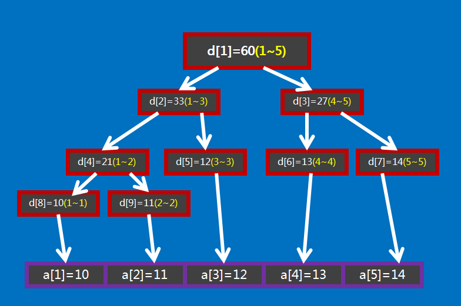

# 线段树

线段树英文名Segment Tree。

线段树是用来维护区间信息的数据结构。

线段树可以在$O(\log{n})$时间复杂度内实**现单点修改、区间修改、区间查询(区间求和，求区间最大值，求区间最小值)**等操作。

**线段树维护的信息，需要满足可加性**，即能以可以接受的速度合并和修改信息**，包括在使用懒惰标记时，标记也要满足可加性。**

## 一、线段树基本原理

**线段树==将每个长度不为1的区间划分成左右两个区间递归求解==**，把整个线段划分为一个树形结构，**通过==合并左右两区间信息来求得该区间的信息==。**所以线段树可以方便地进行大部分的区间操作。


## 二、堆式线段树结构定义与结构操作

### 1.堆式存储结构定义

线段树一定是满二叉树，这里采用堆式存储。

比方说，下面将大小为5的数组$a={10,11,12,13,14}$，转化为了线段树。设线段树的根节点编号为1,用数组$d$来保存线段树，$d[i]$用来保存线段树上编号为$i$的节点的值(**每个节点所维护的值就是这个节点所表示的区间的总和**)



如果$d[i]$表示的是区间$[s,t]$，即$d[i]=\sum_{j=s}^{t}a[j]$，那么$d[i]$的左孩子节点$d[2*i]$表示的是区间$[s,\frac{s+t}{2}]$，$d[i]$的右孩子$d[2*i+1]$表示的是区间$[\frac{s+t}{2}+1,t]$ 。

当$d[i]$表示的区间大小等于1的话，即$d[i]$所表示的区间$[s,t]$中一定有$s=t$，且$d[i]=a[s]=a[t]$，这就是线段树的递归边界。

关于线段树的空间：如果采用的是堆式存储，在有n个叶子节点的情况下，d数组的范围最大是$2^{\lceil\log{n}\rceil+1}$，直接开$4n$大小的空间就行。

因此，堆式存储的结构定义如下：

```c++
typedef struct Node {
    // lazy是懒惰标记，初始化为0
    int value, left, right, lazy;
} Node;

typedef struct SegmentTree {
    Node **data;
    int size;
} SegmentTree;
```


### 2.堆式线段树结构操作

#### (1)初始化堆式线段树

```c++
// 初始化堆式线段树
SegmentTree *getNewSegmentTree(int size) {
    SegmentTree *tree = (SegmentTree *) malloc(sizeof(SegmentTree));
    tree->data = (Node **) calloc(sizeof(Node *), size);
    tree->size = size;
    return tree;
}
```

#### (2)建立线段树

根据数组建立线段树，这也是一个具有完全包含关系的问题，使用递归的方法，先求出左右区间的信息，之后合并为本区间的信息。

```c++
// 根据数组建立线段树
void buildSegmentTree(int *arr, SegmentTree *tree, int ind, int left, int right) {
    // 边界条件
    if (left == right) {
        tree->data[ind] = getNewNode(arr[left], left, right);
        return ;
    }
    int mid = (left + right) >> 1;
    // 递归处理
    buildSegmentTree(arr, tree, ind << 1, left, mid);
    buildSegmentTree(arr, tree, ind << 1 | 1, mid + 1, right);
    // value是孩子处理完了之后，在递归回溯的过程中获得的，并且实际的节点也是在回溯过程中建立的。
    tree->data[ind] = getNewNode(tree->data[ind << 1]->value + tree->data[ind << 1 | 1]->value, left, right);
}
```

#### (3)区间查询

常见的区间查询操作有求区间总和，最大值，最小值等。一般地，如果要查询的区间是$[l,r]$，则可以将其拆成最多$O(\log{n})$个极大的区间，合并这些区间就可以求出答案。这也是一个具有完全包含关系的问题，采用递归求解。

```c++
int query(SegmentTree *tree, int ind, int left, int right) {
    // 当前区间与查询区间没有交集，返回0
    if (tree->data[ind]->left > right || tree->data[ind]->right < left) return 0;
    // 当前区间是查询区间的子集，返回区间值
    if (tree->data[ind]->left >= left && tree->data[ind]->right <= right) 
    return tree->data[ind]->value;
    // 否则，需要进入区间内进行查询，懒惰标记下沉
    tree->data[ind << 1]->lazy += tree->data[ind]->lazy;
    //，更新孩子节点的区间值和懒惰标记
    tree->data[ind << 1]->value += tree->data[ind << 1]->lazy * (tree->data[ind << 1]->right - tree->data[ind << 1]->left + 1);
    tree->data[ind << 1 | 1]->lazy += tree->data[ind]->lazy;
    tree->data[ind << 1 | 1]->value += tree->data[ind << 1 | 1]->lazy * (tree->data[ind << 1 | 1]->right - tree->data[ind << 1 | 1]->left + 1);
    // 本节点懒惰标记置为0
    tree->data[ind]->lazy = 0;
    // 进入左右孩子进行查询
    return query(tree, ind << 1, left, right) + query(tree, ind << 1 | 1, left, right);
}

```

#### (4)单点修改

线段树的单点修改实际上就是对下标的二分查找的过程，修改完后，在回溯的过程中更新路径上节点的值。时间复杂度为$O(\log{n})$。

```c++
void one_element_modify(SegmentTree *tree, int ind, int elem_ind, int new_value) {
    if (tree->data[ind]->left == tree->data[ind]->right) {
        tree->data[ind]->value = new_value;
        return ;
    }
    int mid = (tree->data[ind]->left + tree->data[ind]->right) >> 1;
    if (mid >= elem_ind) one_element_modify(tree, ind << 1, elem_ind, new_value);
    else one_element_modify(tree, ind << 1 | 1, elem_ind, new_value);
    tree->data[ind]->value = tree->data[ind << 1]->value + tree->data[ind << 1 | 1]->value;
}
```


#### (5)区间修改与懒惰标记

进行区间修改时引入懒惰标记，降低时间复杂度。

在没有进入区间内进行查询的时候，懒惰标记不变; **在进入区间内进行查询的时候**，**下传懒惰标记。**

> ==**懒惰标记>0说明当前节点的子孩子是没有更新的**==，区间查询时只有在进入当前节点代表的区间时，才会下传懒惰标记，记得==**在下传懒惰标记的时候孩子的值也是发生变化的。**==

```c++
void interval_modify(SegmentTree *tree, int ind, int left, int right, int add_value) {
    // 当前区间与修改区间没有交集，直接退出
    if (tree->data[ind]->left > right || tree->data[ind]->right < left) return ;
    // 当前区间是修改区间的子集，那么就在这里更新懒惰标记与区间值，不往下继续了
    if (tree->data[ind]->left <= left && tree->data[ind]->right >= right)  {
        tree->data[ind]->value += add_value * (tree->data[ind]->right - tree->data[ind]->left + 1);
        tree->data[ind]->lazy += add_value;
        return ;
    }
    // 否则，在左右孩子中分别进行区间修改，孩子修改完之后，记得更新当前节点的区间值
    interval_modify(tree, ind << 1, left, right, add_value);
    interval_modify(tree, ind << 1 | 1, left, right, add_value);
    // 更新当前节点的区间值
    tree->data[ind]->value = tree->data[ind << 1]->value + tree->data[ind << 1 | 1]->value;
}
```


**==不管是单点修改，还是区间修改，最后都需要对当前节点的区间值进行更新！！！==**