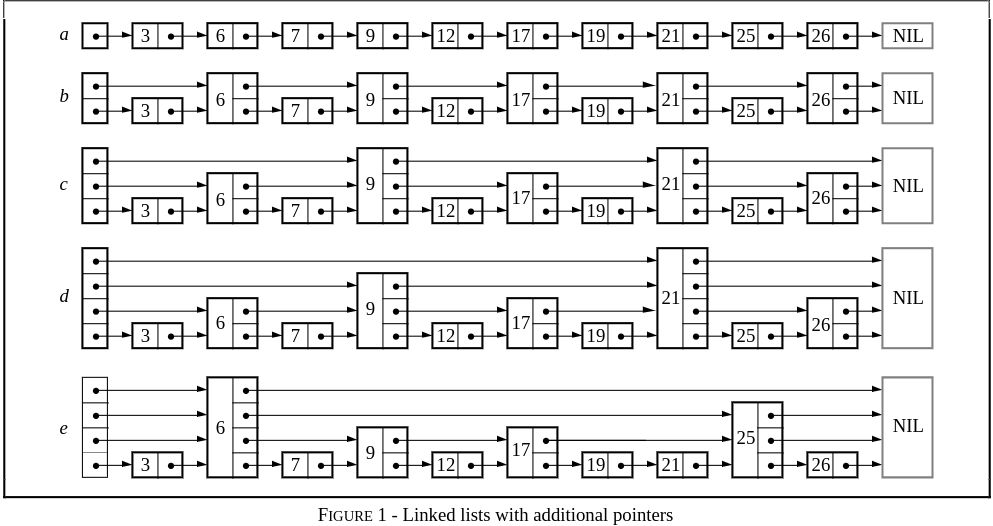
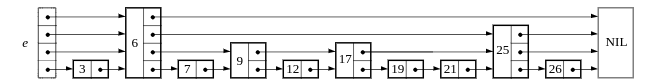

# 跳表(Skip List)

跳表(Skip List)是一种查找数据结构，支持对数据的快速查找、插入和删除。

跳表的期望空间复杂度为$O(n)$，跳表的查询、插入和删除操作的期望时间复杂度都是$O(\log n)$。

## 一、原理

跳表是一种类似于链表的数据结构，更准确地说，跳表是对有序链表的改进。

一个有序链表的查找操作，就是从头部开始逐个比较，直到当前节点的值大于或等于目标节点的值。这个操作的时间复杂度为$O(n)$。

跳表在有序链表的基础上，引入了**分层**的概念。首先，跳表的**每一层都是一个有序链表**，特别地，最底层是初始的有序链表。**每个位于第i层的节点有p的概率出现在第i + 1层，p为常数**。

跳表的结构如下图所示：



> 这个实际上是因为跳表要保证数据的分布均衡性，一个数据插入原始链表之后，该数据可能会造成一段数据过多，要在上层出现，但是这个层数是不确定的，因此，一般使用随机生成的层数。

**我们可以发现，跳表的节点实际上是一个包含了节点值，节点指针数组的结构，==结点指针数组指向下标对应层该节点的孩子，实际上意味着出现该节点的层==。**

记在n个节点的跳表中，期望包含$\frac{1}{p}$个元素的层为第$L(n)$层，易得$L(n)=\log_{\frac{1}{p}}{n}$。(也就是最上层的层数)。

在跳表中查找，就是**从第$L(n)$层开始，水平地逐个比较直至当前节点的下一个节点大于等于目标节点，然后移动至下一层。重复这个过程直到到达第一层且无法继续进行操作。**此时，若下一个节点是目标节点，则成功查找; 反之，则元素不存在。这样，查找的过程中会跳过一些没有必要的比较，所以，相比于有序链表的查询，跳表的查询更快，平均时间复杂度为$O(\log n)$。


## 二、数据定义与数据操作

### 1.数据定义

跳表的结构图如下：



这里的NIL理应存储一个比所有其他节点值都大的值，但是这样不通用，所以，redis中没有使用NIL，而是NULL，但是我们也可以使用NIL，只是有部分操作需要判断下一个是否是NIL即可。

> 这里先使用redis的实现。

#### (1)跳表节点结构定义

根据跳表结构图可以发现，**跳表节点中的指针数组大小实际意味着其在哪些层出现了**，同一个值在那些层出现，实际上不需要什么每一层新建节点，而是对一个节点记录下其会出现的层数，**一个节点贯穿多层。**

不过这个图中的表示依旧不完全，**跳表节点需要指向同层前面节点的指针，这是为了方便插入与删除节点。**

```c++
struct SkipListNode {
    int __value; // __value表示节点存储的值
    int __level; // __level表示节点存在的层的数量
    SkipListNode *backward; // backward指向前一个节点的指针
    SkipListNode **forward; // forward指向一层下一个节点的指针数组

    SkipListNode() :
    __value(0),
    __level(0),
    backward(nullptr),
    forward(nullptr) {}

    SkipListNode(int value, int level) : 
    __value(value), 
    __level(level),
    backward(nullptr),
    forward(new SkipListNode *[level + 1]) {
        for (int i = 0; i <= level; i++) forward[i] = nullptr;
    }

    ~SkipListNode() {
        if (forward) delete[] forward;
    }
};
```


#### 2.跳表结构定义

```c++
struct SkipList {   
    static const int MAX_LEVEL = 32;  // 跳表最高层数
    static const int P = 4;  // 概率，表示一个节点有1 / 4的概率从i层上升到i + 1层
    static const int S = 0xffff; // 配合P使用，保证实际情况下一个节点有1 / 4的概率从i层上升到i + 1层， 见后面的randomLevel()函数
    static const int PS = S / P;

    // header即首节点，即上图中最前面的点
    // tail是尾节点，不过这里的tail不是NIL，而是底层链表的最后一个节点
    // 但是换种写法，tail就可以作为NIL了
    SkipListNode *header, *tail;
    int __length; // __length表示底层链表长度，即跳表的实际存储的数据个数
    int __level; // __level是跳表当前的最高层层数

    SkipList() : 
    __length(0),
    __level(1),
    // header默认是拥有最高层数的。
    header(new SkipListNode(0, MAX_LEVEL)),
    tail(nullptr) {
        // 随机化时间种子
        srand(time(0));
    }
};
```


### 2.结构操作

#### (1)插入节点

```c++
// randomLevel用于随机获取当前插入节点需要上移到的层数
int randomLevel() {
    int level = 1;
    // 这里可以证明rand() & S < PS的概率确定是1/4
    while ((rand() & S) < PS) level++;
    // 确保层数在有效范围内
    return min(level, MAX_LEVEL);
}

// 插入节点
SkipListNode *insert_node(int value) {
    // update用来存储需要修改的节点
    SkipListNode *update[MAX_LEVEL], *x;
    int level;
    
    x = this->header;
    // 从高层往低层找，每一层找到最后一个小于value的节点，此即需要修改的节点，存储到update数组中
    for (int i = this->__level - 1; i >= 0; i--) {
        while (x->forward[i] && x->forward[i]->__value < value) 
            x = x->forward[i];
        update[i] = x;
    }

    // 获取当前节点最高上移到层号
    level = randomLevel();
    // 如果当前跳表的最高层数小于level，就将header作为这些高层的需要修改的节点，之后更新跳表当前最高层数
    if (level > this->__level) {
        for (int i = this->__level; i < level; i++) {
            update[i] = this->header;
        }
        this->__level = level;
    }

    x = new SkipListNode(value, level);
    // 逐层修改需要修改的节点
    for (int i = 0; i < level; i++) {
        // 第i层中，新节点的下一个节点是update[i]的下一个节点，类似于链表插入操作
        x->forward[i] = update[i]->forward[i];
        update[i]->forward[i] = x;
    }

    // 更新x的前一个节点，这个就是根据最底层需要修改的节点来判断，如果update[0]是header的话，那么这个节点就是最前面的，即最小的节点，但是redis的实现中，这个节点的backward是nullptr。
    x->backward = (update[0] == this->header ? nullptr : update[0]);
    // 如果x在底层是不是最后一个节点的话，就需要更新x在底层后一个节点的前一个节点指针， 否则，记录最后一个节点
    if (x->forward[0]) x->forward[0]->backward = x;
    else this->tail = x;
    this->__length++;
    return x;
} 
```


### (2)查找操作

```c++
SkipListNode *find(int value) {
    // 这部分就和插入节点中差不多
    SkipListNode *x = this->header;
    for (int i = this->__level - 1; i >= 0; i--) {
        while (x->forward[i] && x->forward[i]->__value < value) 
            x = x->forward[i];
        // 判断是否找到
        if (x->__value == value) return x;
    }
    return nullptr;
}
```


### (3)删除节点操作

```c++
// 删除值为value的节点
void delete_node(int value) {
    // update用来记录需要修改的节点
    SkipListNode *update[MAX_LEVEL], *x;
    x = this->header;
    for (int i = this->__level - 1; i >= 0; i--) {
        while (x->forward[i] && x->forward[i]->__value < value) 
            x = x->forward[i];
        update[i] = x;
    }
    // x是一层中最后一个值小于value的节点，则其后一个节点要么为nullptr，要么值大于等于value
    x = x->forward[0];
    // 如果x为nullptr则表示无此节点，若此时x的值不等于value，也表示没有值为value的节点，只有有才可以进行删除操作
    if (x && x->__value == value) {
        // 逐层修改节点
        for (int i = 0; i < this->__level; i++) {
            // 因为update中有些节点的后一个节点不是x，这种节点不需要修改
            if (update[i]->forward[i] == x) 
                update[i]->forward[i] = x->forward[i];
        }
        // 判断x是否是第一个节点
        if (x->forward[0])
            x->forward[0]->backward = x->backward;
        
        // 将多余的层去除
        while (this->__level > 1 && this->header->forward[this->__level - 1] == nullptr) this->__level--;
        this->__length--;
        delete x;
    }
}
```


